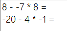

# BrainBright
BrainBright will let your brain start thinking.   
* No Calculate error
* No MISTAKE 

--------

It works as below.  


All the text files are created in same directory with *BrainBright.exe*

## patterns.txt - Customize calculate pattern
### Example
```
? + ? = 
? - ? * ? =
```

## output.txt
BrainBright replace '?' at pattern to random number & It is the result.  

### Example
